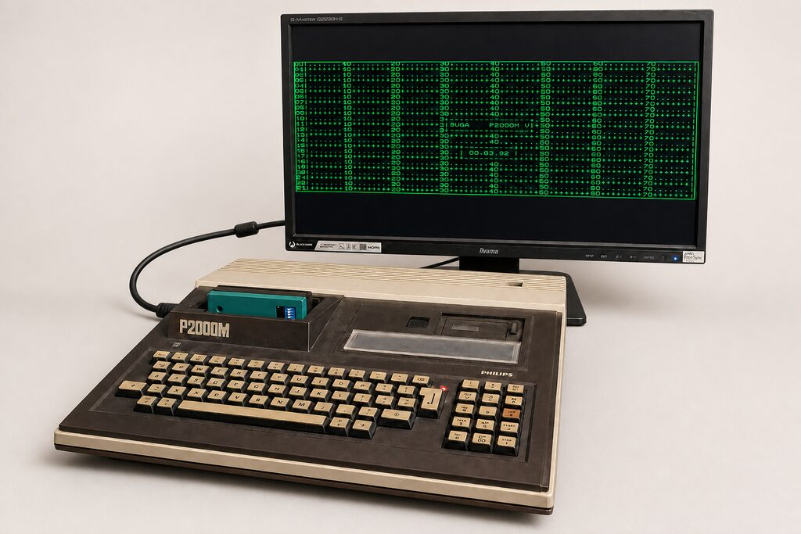
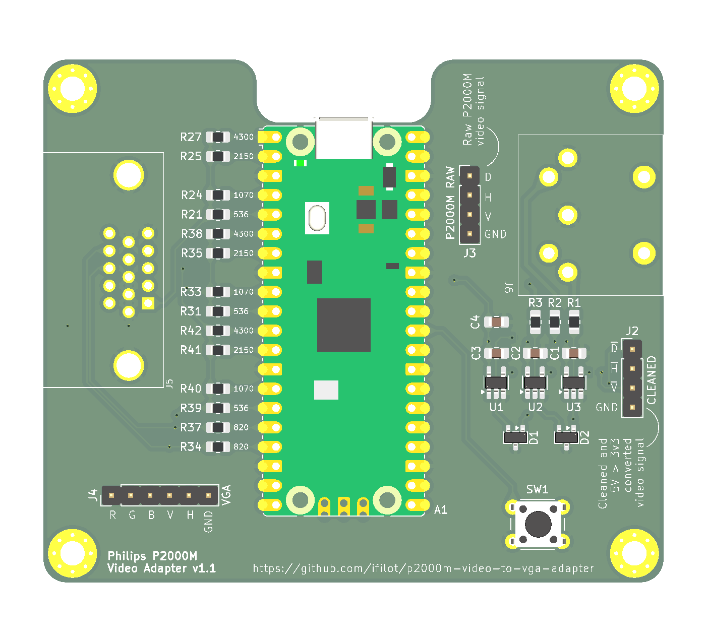
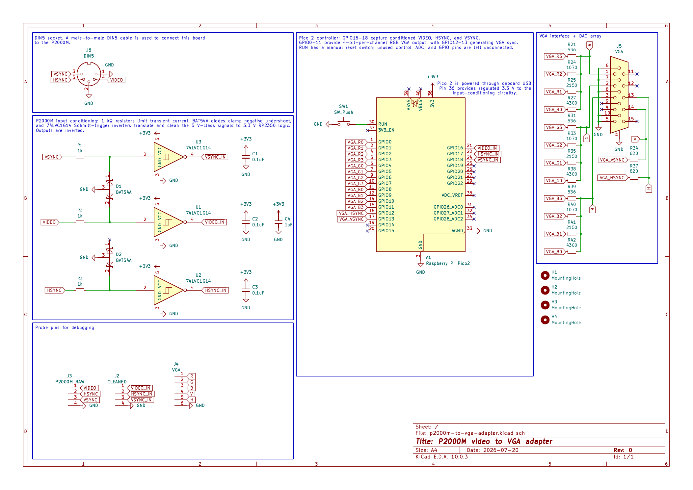

<!--
SPDX-FileCopyrightText: 2026 Ivo Filot <ivo@ivofilot.nl>
SPDX-License-Identifier: CC-BY-4.0
-->

# P2000M VID2VGA adapter

[](https://github.com/ifilot/p2000m-video-to-vga-adapter/actions/workflows/firmware.yml)



This repository contains the adapter PCB and Raspberry Pi Pico 2 firmware for
converting the Philips P2000M raw monochrome video output to VGA.

The adapter captures the conditioned P2000M signals on GPIO16-18,
recovers the source dot grid in software, and presents a tear-free 640 x 288
source image in a 640 x 480, 60 Hz VGA raster. The asynchronous 50.095 Hz
source is repeated as needed at VGA frame boundaries.

By default, the 288 source lines are displayed one-to-one between 96-line top
and bottom margins. An optional fit mode expands them to all 480 VGA lines using
symmetric nearest-neighbour 5:3 scaling. Each three-line source group becomes
five output lines in a 2,1,2 repetition pattern, preserving hard text edges
without introducing gray interpolation pixels.

## Hardware

The adapter conditions the P2000M video and synchronization signals for the
Pico 2, then converts the Pico's 12-bit RGB output and synchronization signals
to a standard VGA connection.

[](images/p2000m-to-vga-adapter.png)

*3D rendering of the assembled adapter. The board design is in
[`pcb/p2000m-to-vga-adapter.kicad_pcb`](pcb/p2000m-to-vga-adapter.kicad_pcb).*

[](pcb/p2000m-to-vga-adapter.pdf)

*Circuit schematic. Select the image to open the PDF; the editable source is
[`pcb/p2000m-to-vga-adapter.kicad_sch`](pcb/p2000m-to-vga-adapter.kicad_sch).*

## Building

The build requires Git, CMake, Ninja, and an Arm GNU embedded toolchain. The
first configuration automatically downloads the pinned Pico SDK 2.3.0 and
matching `pico-extras` release into the build directory; later configurations
reuse those checkouts.

On Debian or Ubuntu, install the host tools and cross-compiler with:

```sh
sudo apt update
sudo apt install git cmake ninja-build build-essential \
  gcc-arm-none-eabi libnewlib-arm-none-eabi \
  libstdc++-arm-none-eabi-newlib
```

```sh
cmake -S . -B build -G Ninja \
  -DCMAKE_BUILD_TYPE=Release
cmake --build build
```

Pico 2 and its `rp2350-arm-s` platform are project defaults, so
`-DPICO_BOARD=pico2` is no longer necessary.

For an offline or custom SDK installation, explicitly pass
`-DPICO_SDK_PATH=/path/to/pico-sdk` and
`-DPICO_EXTRAS_PATH=/path/to/pico-extras`; these overrides take precedence over
automatic downloading.

Flash the single generated image:

```text
build/src/p2000m-vid2vga-firmware.uf2
```

> [!WARNING]
> The current experimental firmware runs the RP2350 at 252 MHz and 1.30 V,
> beyond Raspberry Pi's 150 MHz rating. This preserves exact integer divisors
> for the 63 MHz capture and 25.2 MHz VGA clocks, but stability, temperature,
> lifetime, and operation across devices are not guaranteed. BOOTSEL recovery
> remains available if the firmware does not start reliably. The configuration
> that sustained 25 FPS was tested with a cooling block fitted directly to the
> RP2350 package. A properly mounted heatsink or equivalent cooling block, with
> adequate surrounding airflow, is strongly recommended for prolonged use at
> 252 MHz; cooling reduces thermal risk but does not make the overclock an
> in-spec operating condition.

### Desktop screen viewer

The `gui` directory contains a Qt 6 application for Windows, Linux, and macOS.
It automatically finds Raspberry Pi Pico CDC ports, verifies the VID2VGA
firmware, switches the adapter into binary screen mode, and displays complete
CRC-checked frames. It
returns the adapter to console mode when Disconnect is selected or the window
is closed. Its Adapter menu can configure colors, borders, scaling, sampling
phase, and optional persistent storage through the firmware's console.
The viewer uses a monitor-derived application icon, places rolling live
performance graphs beside the screen, and keeps the status bar focused on the
COM port and source frame number. It can save lossless screenshots and can
record H.264 MP4 video through the FFmpeg runtime included in every packaged
viewer distribution.

Build it from an MSYS2 UCRT64 shell with Qt 6 installed:

```sh
cmake -S gui -B build-gui -G Ninja -DCMAKE_BUILD_TYPE=Release
cmake --build build-gui
```

See [`gui/README.md`](gui/README.md) for use and build instructions and
[`gui/PACKAGING.md`](gui/PACKAGING.md) for CI packaging and tagged releases.

## Video capture and VGA conversion

The P2000M connector does not carry a VGA-compatible raster. It exposes a
one-bit monochrome `VIDEO` signal plus separate `HSYNC` and `VSYNC` timing
signals. The adapter first converts those signals to safe 3.3 V logic, then the
Pico measures and reconstructs the original dot grid before generating a new,
independent VGA raster. The complete path is:

```text
P2000M DIN-5 -> protection and Schmitt-trigger conditioning
             -> PIO sampling and DMA raw-frame buffers
             -> 640 x 288 one-bit reconstructed frames
             -> color mapping and 640 x 480 VGA scanout
```

### P2000M source timing

The P2000M derives its display timing from a 12 MHz dot clock. Eight dots form
one character time and 96 character times form one 64 microsecond scanline.
Only 80 character times contain picture data, giving 640 visible dots per line.
Twelve scanlines form a character row and 26 hardware rows form a frame, for a
nominal frame rate of approximately 50.1 Hz.

The 24 rows stored in video memory do not have the same numbers as the hardware
timing rows. Video-memory rows 0 through 23 appear in hardware rows 1 through
24. Hardware rows 25 and 0 are part of the vertical blanking and preparation
interval. `VSYNC` is active during hardware row 24, the final visible row:

```text
hardware row 24  video-memory row 23; VSYNC active
hardware row 25  vertical blanking                     } skipped
hardware row 0   vertical blanking / row preparation   } skipped
hardware row 1   video-memory row 0; capture starts
       ...
hardware row 24  video-memory row 23; capture ends
```

The capture state machine waits for the trailing edge of the active-low
conditioned `VSYNC`, which marks the start of hardware row 25. It then counts 24
`HSYNC` edges to skip hardware rows 25 and 0. Capturing the following 288
scanlines therefore covers hardware rows 1 through 24, or exactly 80 x 24
characters. This distinction is important: treating the assertion of `VSYNC`
as row 0 would capture one blank character row and omit video-memory row 23.

### Probing and input conditioning

The three P2000M signals enter through the DIN-5 connector. Each input has a
1 kΩ series resistor to limit transient current and a BAT54A clamp for negative
undershoot. A 3.3 V-powered 74LVC1G14 Schmitt-trigger inverter translates the
5 V-class input to RP2350 logic levels, cleans up slow or noisy edges, and
inverts its polarity before it reaches the Pico:

| P2000M signal | Conditioned signal | Pico input | Purpose |
| --- | --- | --- | --- |
| `VIDEO` | `~VIDEO_IN` | GPIO16 | Monochrome dot level |
| `HSYNC` | `~HSYNC_IN` | GPIO17 | Start reference for every scanline |
| `VSYNC` | `~VSYNC_IN` | GPIO18 | Frame and hardware-row reference |

All three conditioned inputs are consequently active-low. For `VIDEO`, a low
sample represents foreground and a high sample represents background.

### Line capture and pixel reconstruction

PIO1 runs at 63 MHz and anchors every captured line independently to the
leading edge of conditioned `HSYNC`. After a fixed delay to just before the
active picture, it oversamples `VIDEO` for 54.286 microseconds. Independent
line synchronization prevents small timing errors from accumulating vertically.

The PIO loop takes 14 consecutive samples followed by one branch cycle without
a sample. Two loops are packed into each DMA word, so a word holds 28 useful
samples representing 30 PIO clock ticks. A line contains 114 words and a raw
frame contains 288 such lines. DMA writes complete frames into three buffers so
capture can continue while software reads an older completed frame.

The source clock is not phase-locked to the Pico. The firmware therefore
measures the source frame period, divides it over the known 312 scanlines and
768 dot periods per line, and builds a map from each of the 640 output pixels to
the appropriate raw samples. It tests five nearby horizontal phases and selects
the phase with the strongest foreground content. For each reconstructed pixel,
three adjacent samples are examined; if any is foreground, the output pixel is
foreground. This preserves narrow character strokes without introducing gray
interpolation pixels. A double-buffered map ensures that a timing adjustment
cannot change partway through decoding a frame.

Core 0 converts the newest completed raw capture into a packed 640 x 288 one-bit
frame. Three decoded-frame buffers separate this work from VGA generation on
core 1.

### VGA presentation

The Pico generates a standard 640 x 480 raster with a 25.2 MHz pixel clock and
a nominal 60 Hz refresh rate. The P2000M and VGA rates are asynchronous, so core
1 switches to the newest decoded source frame only at the beginning of a VGA
frame. If no newer P2000M frame is ready, it repeats the current one. A VGA
frame can therefore never contain parts of two source frames.

Complete captured frames also act as a synchronization watchdog. If valid
HSYNC/VSYNC-driven frames stop arriving for 100 ms, VGA remains active and
shows a centered `SIGNAL LOST` warning instead of indefinitely freezing the
last source image. The status card also identifies the adapter and its compiled
firmware version and indicates that capture is waiting for both synchronization
inputs. Live video returns only after two consecutive frame completions
establish a credible source period, preventing a partial recovery frame from
reaching the display.

Horizontally, all 640 reconstructed source pixels map directly to the 640 VGA
pixels. Vertically, native mode presents all 288 source lines one-to-one between
96-line top and bottom margins. Fit mode expands them to 480 lines with
symmetric nearest-neighbour 5:3 scaling: each three-line source group becomes a
2,1,2 pattern of repeated VGA lines.

The one-bit image selects the configured foreground or background color. The
optional border is added during scanout, so it can use an independent color and
a solid or dotted pattern without expanding the one-bit frame buffers. GPIO0
through GPIO11 carry four bits each of red, green, and blue through the resistor
DAC, while GPIO12 and GPIO13 generate VGA synchronization. After every 640-pixel
picture line, the scanout emits black before horizontal blanking so the analog
RGB outputs return to a defined level before synchronization.

## USB controls

Connect a terminal to the Pico USB CDC serial port. Commands are
case-insensitive and execute when Enter is pressed. Command mode echoes input,
supports Backspace/Delete, displays a `vid2vga>` prompt, and produces no
unsolicited statistics.

- `status` or `s`: print capture, decoder, resampler, and VGA statistics.
- `version` or `v`: print the semantic firmware version.
- `license`: print the firmware copyright, license, warranty, and source
  location.
- `log`: stream those statistics every two seconds. Press Enter, Escape, or
  `q` to stop the stream and return to the command prompt.
- `screen [raw|packbits]`: enter the continuous binary framebuffer interface
  used by the Windows viewer. TinyUSB backpressure safely pauses transmission
  when the host cannot keep up, `console` returns to the normal terminal
  interface, and the legacy `frame` command remains accepted for viewer
  compatibility. Omitting the encoding selects raw records.
- `settings`: print all active settings and whether they are factory defaults,
  modified in RAM, or saved in flash.
- `border on`, `border off`, or `border toggle`: control a one-pixel rectangle
  around the 640 x 288 source image.
- `border-color <color>`: set the border color independently of the foreground
  and background colors.
- `border-style solid` or `border-style dotted`: select a continuous border or
  a two-pixel-on, two-pixel-off pattern whose gaps reveal the source image.
- `scale fit`: expand 288 source lines to the full 480-line VGA height.
- `scale native`: show the original 288 lines between 96-line margins.
- `fg <color>`: set the foreground/text color.
- `bg <color>`: set the background color, including the top and bottom margins.
- `colors`: list the named presets.
- `defaults`: restore white on black, a disabled solid magenta (`#FF00FF`)
  border, and native 1:1 scaling.
- `save`: explicitly save the current colors, border state, border pattern,
  scaling mode, and manual phase trim. These settings are restored after reset
  or power cycling.
- `factory-reset`: erase the saved configuration and immediately restore the
  factory display style and zero manual phase trim.
- `tune` or `j`: run automatic phase tuning and print all candidate scores.
- `phase +`, `phase -`, or `phase auto`: adjust or clear the manual phase trim.
- `geometry` or `g`: print coverage totals for all 80 x 24 character cells.
- `help`, `h`, or `?`: print the command reference.

Colors may be selected by name (`black`, `white`, `green`, `amber`, `cyan`,
`magenta`, `red`, `blue`, `yellow`, or `gray`) or entered as `RRGGBB`,
`#RRGGBB`, or `0xRRGGBB`. The VGA output hardware is RGB444, so the upper four
bits of each entered eight-bit channel determine the physical output level.

Settings are only written when `save` is entered, avoiding unnecessary flash
wear while experimenting. Two versioned, checksummed flash records are used in
alternation, so an interrupted save leaves the previous valid configuration
available. Saving or erasing briefly pauses both cores and may cause a momentary
VGA blink. Automatic phase selection is always recalculated from the live
signal; only the user's manual phase trim is persistent.

Automatic tuning runs about once every five seconds. The `stale_replaced`
counter normally increases when newer raw frames supersede frames that no
consumer needed; it is not itself a capture failure.

Screen mode sends a 48-byte versioned header followed by a complete packed
monochrome framebuffer. Type-one records contain the native 23,040-byte image.
Type-two records use standard PackBits controls: 0 through 127 introduce 1
through 128 literal bytes, 129 through 255 repeat the next byte 128 through 2
times, and 128 is a no-op. PackBits is selected independently for each frame
only when smaller than raw data, so incompressible screens cannot expand the
USB traffic. PackBits runs are aggregated into approximately 1 KiB staging
blocks before entering TinyUSB. The payload-size header field describes the
transmitted data and its CRC-32 always covers the reconstructed 23,040-byte
framebuffer. When flags bit 2 is set, header bytes 12 through 15 contain two
little-endian 16-bit diagnostics: current preparation time and previous-frame
streaming-encoder CPU time, both in microseconds.

Frames are independently recoverable and limited to every second decoded
source sequence (approximately 25.05 frames per second).
USB transmission is continuous and best effort: a slow or disconnected host
can reduce the viewer rate but cannot take the framebuffer currently required
by VGA output. The current viewer selects raw records by default and offers
PackBits as an experimental Adapter-menu option. It also negotiates the older
per-frame credit mode when connected to an earlier compatible firmware build.
Plain `screen` remains raw for older viewer compatibility.

## Licensing

This is a multi-license project:

- The firmware, build configuration, CI workflow, and P2000M screen-test
  program are licensed under the
  [GNU GPL version 3 or later](LICENSES/GPL-3.0-or-later.txt).
- The PCB, schematic, custom footprints, and generated hardware views are
  licensed under the
  [CERN Open Hardware Licence Version 2—Strongly Reciprocal](LICENSES/CERN-OHL-S-2.0.txt).
- This README and the changelog are licensed under
  [Creative Commons Attribution 4.0](LICENSES/CC-BY-4.0.txt).

See [LICENSE.md](LICENSE.md) for the exact file scopes and
[THIRD_PARTY_NOTICES.md](THIRD_PARTY_NOTICES.md) for components incorporated
from the Raspberry Pi Pico SDK, `pico-extras`, and TinyUSB.
